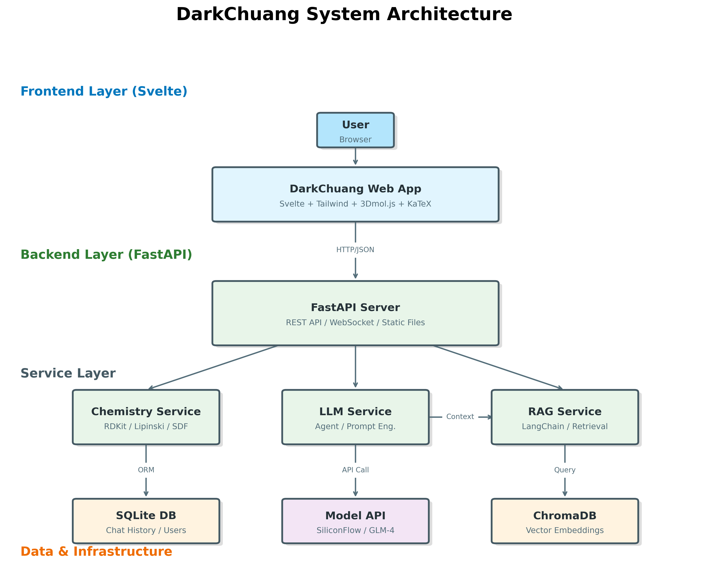

# DarkChuang

<div align="center">


</div>

基于 **GLM-4V 多模态大模型**、**RAG 知识库** 和 **RDKit 化学计算引擎** 的新一代智能化学助手。

## 系统架构



## 项目简介

**DarkChuang** 是一个现代化的化学问答机器人系统。相较于传统的大模型对话，本项目深度集成了专业的化学工具链和 Agentic Workflow（代理工作流），能够提供精准的分子计算、结构可视化、基于知识库的问答以及专业的 NMR 光谱分析能力。

### 核心亮点 (v2.1)

- 🤖 **Agentic NMR 分析**: 引入代理工作流，结合 **VLM (视觉大模型)** 进行峰值提取、**LLM** 进行逻辑推理、**RDKit** 进行化学规则验证，实现高精度的核磁共振谱图解析。
- 📚 **RAG 知识增强**: 支持上传 PDF/TXT 等化学文献构建本地知识库，基于 **ChromaDB** 向量检索，让回答有据可依。
- 🧪 **专业化学计算**: 内置 **RDKit** 引擎，支持分子量、LogP、TPSA等物理属性的精确计算，告别大模型"瞎猜"。
- 🧬 **实时结构可视化**: 自动识别对话中的化学物质（如"Aspirin"），实时生成 2D 分子结构图和 **3D 交互式模型**，并持久化存储。
- 💾 **持久化历史记录**: 基于 SQLite 的完整对话历史存储，支持图片上传回显和历史会话管理。
- ⚛️ **极简交互**: 全新重构的 Svelte + TailwindCSS 前端，专注于沉浸式化学探索体验。
- 🔍 **全屏预览**: 支持图片和 3D 模型的全屏放大预览，提供更清晰的细节观察体验。

## 技术栈

### 后端技术
- **框架**: Python 3.10+ + FastAPI
- **AI模型**: GLM-4V-Plus / GLM-4-Plus (via SiliconFlow API)
- **化学引擎**: RDKit (分子计算、绘图、验证)
- **向量数据库**: ChromaDB (RAG 检索)
- **数据库**: SQLite (会话历史存储)
- **ORM**: SQLAlchemy
- **异步处理**: Uvicorn + Aiofiles

### 前端技术
- **框架**: Svelte 4 + Vite
- **语言**: TypeScript
- **样式**: Tailwind CSS
- **状态管理**: Svelte Stores
- **HTTP**: Fetch API

## 快速开始

### 🚀 一键启动 (Windows / macOS / Linux) - 推荐
项目根目录提供了智能启动脚本，**自动完成环境配置和依赖安装**，实现开箱即用：

**Windows 用户:**
1. 确保已安装 **Python 3.10+** 和 **Node.js**。
2. 双击运行 `start_dev.bat`。

**macOS / Linux 用户:**
1. 确保已安装 **Python 3** 和 **Node.js**。
2. 在终端运行：
```bash
chmod +x start_dev.sh
./start_dev.sh
```

脚本将自动检测环境、创建虚拟环境、安装 Python/Node 依赖（自动配置国内源）、生成配置文件并启动服务。

### 手动启动步骤

### 1. 克隆项目
```bash
git clone https://github.com/qwe4559999/DarkChuang.git
cd DarkChuang
```

### 2. 后端启动
```bash
cd backend
# 建议使用 Conda 或 venv 创建虚拟环境
python -m venv venv
.\venv\Scripts\activate

# 安装依赖
pip install -r requirements.txt

# 配置 API Key
# 在 backend 目录下创建 .env 文件
# SILICONFLOW_API_KEY="your-api-key"

# 启动服务
uvicorn app.main:app --reload
```

### 3. 前端启动
```bash
cd frontend
# 安装依赖
npm install

# 启动开发服务器
npm run dev
```

### 4. 访问应用
打开浏览器访问: `http://localhost:5173`

## 功能演示

### 1. 智能 NMR 谱图分析 (Agentic Workflow)
用户上传一张 NMR 谱图或输入峰值数据。
系统执行代理流程:
1. **感知**: VLM 模型识别图像中的峰值和化学位移。
2. **推理**: LLM 根据峰值推断可能的结构片段。
3. **验证**: RDKit 验证推断结构的化学合理性。
4. **输出**: 给出最可能的分子结构及其置信度。

### 2. 分子查询与可视化
用户输入: *"Show me the structure of Caffeine"*
系统响应:
- 自动提取 "Caffeine"
- 调用 RDKit 生成咖啡因的分子结构图 (PNG)
- 计算并展示 MW, LogP 等属性

### 3. 知识库问答 (RAG)
用户上传化学文献 PDF。
用户提问: *"这篇文献中提到的合成路线是什么？"*
系统响应:
- 检索向量数据库中的相关段落
- 结合上下文生成准确回答

## 目录结构

```
DarkChuang/
├── backend/                # FastAPI 后端
│   ├── app/
│   │   ├── api/            # API 路由 (Chat, Chemistry, Knowledge)
│   │   ├── core/           # 核心配置
│   │   ├── db/             # 数据库模型
│   │   ├── services/       # 业务逻辑 (LLM, RAG, Chemistry)
│   │   └── tools/          # Agent 工具
│   ├── data/               # 数据存储 (Vector DB, Uploads)
│   └── static/             # 静态资源 (生成的分子图)
├── frontend/               # Svelte 前端
│   ├── src/
│   │   ├── components/     # UI 组件
│   │   ├── lib/            # API 客户端
│   │   └── stores/         # 状态管理
└── docs/                   # 项目文档
```

## 贡献

欢迎提交 Pull Request 或 Issue！

## 许可证

MIT License
